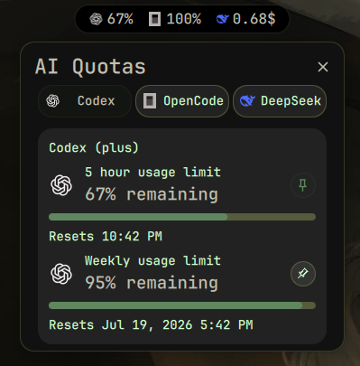

# dms-ai-quotas

Codex and OpenCode Go usage limits plus DeepSeek API balance in your [DankMaterialShell](https://github.com/AvengeMedia/DankMaterialShell) bar.

<p align="center">
  
</p>

## Supported Providers

| Provider | Type | Data shown |
|----------|------|------------|
| **Codex** | ChatGPT plan usage limits | 5-hour, weekly, and code review usage % with reset countdowns |
| **OpenCode Go** | Usage quotas | Rolling (5h), Weekly, Monthly usage % with reset countdowns |
| **DeepSeek API** | Account balance | Available total, API availability, unexpired grants, and paid top-ups |

The plugin is designed to be extensible - additional AI coding providers can be added in the future.

## Features

- Merged bar pill showing Codex and OpenCode usage rings plus DeepSeek API balance
- Codex 5-hour usage ring in the bar pill, with 5-hour, weekly, and code review limits in the popout
- Separators between provider sections in the pill
- Click to open a tabbed provider popout with clean per-limit detail cards
- Pin any Codex, OpenCode, or DeepSeek limit directly from its popout card
- Display mode toggle: show remaining % or used % (synced between pill and popout)
- Reset date/time or countdown shown for each usage limit
- DeepSeek API balance card with availability status, total, unexpired grants, paid top-ups, and logo
- Configurable refresh interval (30s - 300s)
- Toggle each provider on/off independently
- OpenCode Rolling (5h), Weekly, and Monthly windows are always available in the popout
- All credentials configured from DMS settings - no config files needed

## Requirements

- DankMaterialShell >= 1.5.0
- `curl` and `jq`
- For DeepSeek: an API key from [platform.deepseek.com/api_keys](https://platform.deepseek.com/api_keys)
- For Codex: the Codex CLI installed and authenticated with `codex login`
- For OpenCode: workspace ID and auth cookie from [opencode.ai](https://opencode.ai)

## Install

```sh
git clone https://github.com/agneswd/dms-ai-quotas \
          ~/.config/DankMaterialShell/plugins/aiQuotas
```

Then in DMS:
1. Open **Settings - Plugins**
2. Click **Scan for Plugins**
3. Enable **AI Quotas**
4. Add to DankBar layout (**Settings - DankBar Layout**)
5. Restart shell: `dms restart`

## Settings

### General

| Setting | Default | Description |
|---------|---------|-------------|
| Codex | on | Show Codex usage limits from the local Codex login |
| OpenCode | on | Show OpenCode usage quotas |
| DeepSeek | on | Show DeepSeek account balance |
| Refresh Interval | 60s | How often to fetch data (30-300s) |
| Show Reset Times | on | Show reset information in the popout |
| Show Reset Countdown | off | Use a countdown instead of the reset date and time |
| Display Mode | Remaining (%) | Show remaining or used percentage (pill + popout) |

Use the pin button beside any limit in the popout to choose which limits appear in the bar pill. Multiple limits can be pinned at once.

### Credentials

Codex uses the local Codex CLI login automatically. Run `codex login` once; no token needs to be copied into DMS settings.

| Setting | Description |
|---------|-------------|
| DeepSeek API Key | Your DeepSeek API key from platform.deepseek.com/api_keys |
| OpenCode Workspace ID | From the URL: `opencode.ai/workspace/YOUR_ID/go` |
| OpenCode Auth Cookie | The `auth` cookie from opencode.ai |

## How to get OpenCode credentials

1. Open [opencode.ai](https://opencode.ai) in your browser and sign in
2. Navigate to your workspace (e.g. `opencode.ai/workspace/wrk_abc123/go`)
3. Copy `wrk_abc123` from the URL - that's your **Workspace ID**
4. Open browser dev tools (F12) -> Application -> Cookies -> `opencode.ai`
5. Copy the `auth` cookie value - that's your **Auth Cookie**
6. Paste both into DMS Settings -> AI Quotas

## How it works

The plugin reads the local Codex OAuth token from `CODEX_HOME/auth.json` (default `~/.codex/auth.json`), queries the Codex usage endpoint, scrapes the OpenCode workspace dashboard directly via `curl`, and queries the DeepSeek balance API. DeepSeek’s balance endpoint provides account funds and availability, not usage history; detailed usage remains available through the DeepSeek Platform Usage export. No external npm packages required.

```
Codex auth.json  ---> chatgpt.com/backend-api/wham/usage --\
                                                          |---> fetch-usage.sh ---> cache ---> Widget
curl opencode.ai/workspace/{id}/go  --\
curl api.deepseek.com/user/balance  --/
```

## License

MIT
