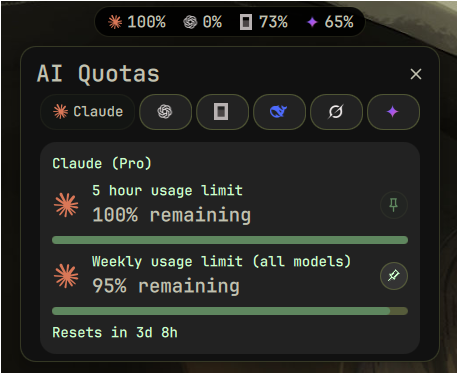

# dms-ai-quotas

Monitor Claude, Codex, OpenCode, Antigravity, DeepSeek, OpenRouter, and Grok usage limits and balances in your [DankMaterialShell](https://github.com/AvengeMedia/DankMaterialShell) bar.

<p align="center">
  
</p>

## Supported Providers

| Provider | Type | Data shown |
|----------|------|------------|
| **Claude** | Claude plan usage limits | 5-hour and weekly usage % with reset countdowns |
| **Codex** | ChatGPT plan usage limits | 5-hour, weekly, and code review usage % with reset countdowns |
| **OpenCode Go** | Usage quotas | Rolling (5h), Weekly, Monthly usage % with reset countdowns |
| **Antigravity** | Agent/model usage quotas | Claude, Gemini Pro, Gemini Flash, Gemini Image usage % and reset times |
| **DeepSeek API** | Account balance | Available total, API availability, unexpired grants, and paid top-ups |
| **OpenRouter** | Account credit balance | Remaining credits, purchased total, and usage |
| **Grok** | Usage limits | Shared weekly usage % with reset countdown, from local `grok login` |

The plugin is designed to be extensible - additional AI coding providers can be added in the future.

## Features

- Merged bar pill showing provider logos, pinned percentages, and DeepSeek and OpenRouter balances
- Claude, Codex, OpenCode, and Grok pinned percentages in the bar pill, with all supported limits in the popout
- Separators between provider sections in the pill
- Click to open a tabbed provider popout with clean per-limit detail cards
- Pin any Claude, Codex, OpenCode, DeepSeek, or Grok item directly from its popout card
- Display mode toggle: show remaining % or used % (synced between pill and popout)
- Reset date/time or countdown shown for each usage limit
- DeepSeek API balance card with availability status, total, unexpired grants, paid top-ups, and logo
- OpenRouter credit balance card with remaining, purchased, and used amounts, and logo
- Grok usage card from local `grok login` (no API key)
- Configurable refresh interval (30s - 300s)
- Toggle each provider on/off independently
- OpenCode Rolling (5h), Weekly, and Monthly windows are always available in the popout
- Claude, Codex, OpenCode, and Grok use local CLI logins. DeepSeek and OpenRouter keys are set in DMS settings.

## Requirements

- DankMaterialShell >= 1.5.0
- `curl` and `jq`
- For Claude: Claude Code 2.1.220 or newer, installed and signed in (`claude`)
- For DeepSeek: an API key from [platform.deepseek.com/api_keys](https://platform.deepseek.com/api_keys)
- For OpenRouter: an API key from [openrouter.ai/settings/keys](https://openrouter.ai/settings/keys). If credit access is denied, create a management key at [openrouter.ai/settings/management-keys](https://openrouter.ai/settings/management-keys)
- For Grok: the Grok CLI installed and authenticated with `grok login`
- For Codex: the Codex CLI installed and authenticated with `codex login`
- For OpenCode: the OpenCode CLI connected with `/connect` to OpenCode Go, or an API key from [opencode.ai](https://opencode.ai)
- For Antigravity: `secret-tool` and an authenticated Antigravity CLI (`agy`)

## Install

```sh
git clone https://github.com/agneswd/dms-ai-quotas \
          ~/.config/DankMaterialShell/plugins/aiQuotas
```

Then in DMS:
1. Open **Settings - Plugins**
2. Click **Scan for Plugins**
3. Enable **AI Quotas**
4. Add to DankBar layout (**Settings - DankBar Layout**)
5. Restart shell: `dms restart`

## Settings

### General

| Setting | Default | Description |
|---------|---------|-------------|
| Claude | on | Show Claude plan usage limits from the local Claude Code login |
| Codex | on | Show Codex usage limits from the local Codex login |
| OpenCode | on | Show OpenCode Go usage quotas from the local OpenCode login |
| Antigravity | on | Show Antigravity agent and model quotas |
| DeepSeek | on | Show DeepSeek account balance |
| OpenRouter | on | Show OpenRouter credit balance |
| Grok | on | Show usage limits from the local Grok login |
| Refresh Interval | 60s | How often to fetch data (30-300s) |
| Show Reset Times | on | Show reset information in the popout |
| Show Reset Countdown | off | Use a countdown instead of the reset date and time |
| Display Mode | Remaining (%) | Show remaining or used percentage (pill + popout) |

Use the pin button beside any limit in the popout to choose which limits appear in the bar pill. Multiple limits can be pinned at once.

### Credentials

Claude, Codex, OpenCode, and Grok use their local CLI logins automatically. Sign in once with `claude`, `codex login`, `opencode /connect` (OpenCode Go), and `grok login`. No tokens need to be copied into DMS settings for those providers. Claude usage comes from Claude Code's native rate-limit data, with a five-minute API fallback when that data is stale.

| Setting | Description |
|---------|-------------|
| DeepSeek API Key | Your DeepSeek API key from platform.deepseek.com/api_keys |
| OpenRouter API Key | Your OpenRouter API key from openrouter.ai/settings/keys |
| OpenCode Go API Key | Optional. Leave empty to use `~/.local/share/opencode/auth.json` |

### Enable Claude quota capture

Add the plugin's capture script as your Claude Code status line in `~/.claude/settings.json`:

```json
{
  "statusLine": {
    "type": "command",
    "command": "sh ~/.config/DankMaterialShell/plugins/aiQuotas/claude-statusline.sh"
  }
}
```

Claude Code provides quota data after the first response in a session. If you already use a custom status line, merge the two `rate_limits` fields from `claude-statusline.sh` into that script instead of replacing it.

## How to get OpenCode credentials

1. Subscribe to Go at [opencode.ai](https://opencode.ai) and copy the API key
2. In the OpenCode TUI run `/connect`, pick **OpenCode Go**, and paste the key
3. The plugin reads the `opencode-go` key from `~/.local/share/opencode/auth.json`
4. If you do not use the OpenCode CLI, paste the same key into DMS Settings -> AI Quotas

## How it works

The plugin captures Claude Code's native `rate_limits` status data locally and polls its usage endpoint at most every five minutes when native data is stale. It reads the local Codex OAuth token from `CODEX_HOME/auth.json` (default `~/.codex/auth.json`) and queries the Codex usage endpoint, reads the OpenCode Go API key from plugin settings or `OPENCODE_DATA_DIR/auth.json` (default `~/.local/share/opencode/auth.json`) and queries `opencode.ai/zen/go/v1/usage`, reads Antigravity credentials from the system keyring and queries its quota API, queries the DeepSeek balance API, queries the OpenRouter credits API with an API key, and reads the local Grok OAuth token from `GROK_HOME/auth.json` (default `~/.grok/auth.json`) to query Grok billing. DeepSeek's balance endpoint provides account funds and availability, not usage history. No external npm packages required.

```
Claude native data + 5m fallback   ---> local usage snapshot --------------\
Codex auth.json                    ---> chatgpt.com/backend-api/wham/usage --\
OpenCode auth.json or API key      ---> opencode.ai/zen/go/v1/usage        --\
System keyring                     ---> Google quota API                    ----> fetch-usage.sh ---> cache ---> Widget
curl api.deepseek.com/user/balance  ---> [Fetch API balance]                 --\
openrouter.ai/api/v1/credits        ---> [Fetch credit balance]              --\
Grok auth.json                     ---> cli-chat-proxy.grok.com/v1/billing --/
```

## License

MIT

The settings UI uses selected components from [dms-common](https://github.com/hthienloc/dms-common) by Loc Huynh.
