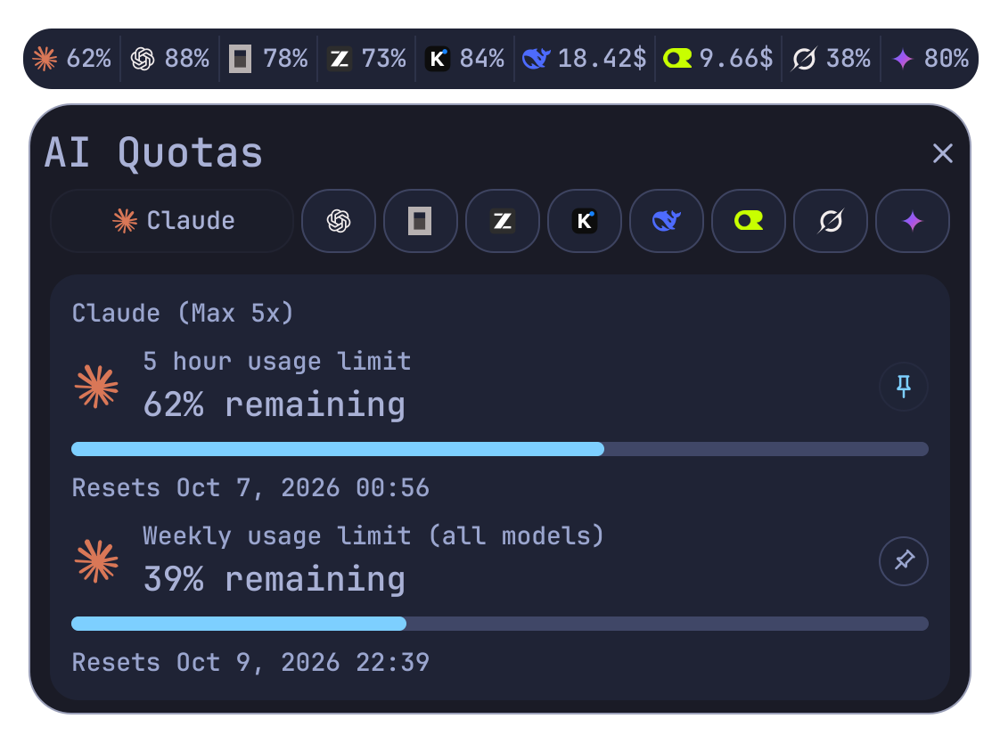

# dms-ai-quotas

Monitor Claude, Codex, OpenCode Go, Z.ai, Kimi Code, DeepSeek, OpenRouter, Grok, and Antigravity usage limits and balances in your [DankMaterialShell](https://github.com/AvengeMedia/DankMaterialShell) bar.

<p align="center">
  
</p>

## Supported providers

| Provider | Data shown | Credentials |
|----------|------------|-------------|
| **Claude** | 5-hour and weekly usage | Local Claude Code login |
| **Codex** | 5-hour, weekly, and code review usage | Local Codex login (`codex login`) |
| **OpenCode Go** | Rolling (5h), weekly, and monthly usage | `opencode /connect`, or an API key |
| **Z.ai Coding Plan** | 5-hour, weekly, and monthly MCP tool usage | API key |
| **Kimi Code** | 5-hour, weekly, and monthly usage | API key, or the `kimi` login |
| **DeepSeek API** | Balance, API availability, grants, and top-ups | API key |
| **OpenRouter** | Remaining, purchased, and used credits | API key |
| **Grok** | Weekly usage or on-demand spending cap | Local Grok login (`grok login`) |
| **Antigravity** | Usage per model group | Local `agy` login in the system keyring |

## Features

- One bar pill with a logo and a value for each pinned limit or balance.
- A popout with one tab per provider. The popout widens until every tab fits.
- Pin any limit or balance from the popout. You can pin several per provider.
- When a provider has no window that matches its pins, the pill shows its first window. For example, Codex free plans have no 5-hour window.
- When a blocking limit is used up, the pill shows the provider as used up, even if the pinned window still has room.
- Show remaining or used percentages, in the pill and the popout.
- Reset times as a date or as a countdown.
- Turn each provider on or off.
- Refresh every 30 to 300 seconds. All providers are fetched in parallel.

## Requirements

- DankMaterialShell 1.5.0 or newer
- `curl` and `jq`
- Optional: `sqlite3`, to read the newest OpenCode Go key from `opencode.db`
- Optional: `secret-tool` from libsecret, for Antigravity only

## Install

```sh
git clone https://github.com/agneswd/dms-ai-quotas \
          ~/.config/DankMaterialShell/plugins/aiQuotas
```

Then in DMS:

1. Open **Settings - Plugins**.
2. Click **Scan for Plugins**.
3. Enable **AI Quotas**.
4. Add the widget to the bar in **Settings - DankBar Layout**.
5. Restart the shell with `dms restart`.

## Settings

| Setting | Default | Description |
|---------|---------|-------------|
| Provider toggles | on | Show or hide each provider |
| Refresh Interval | 60 s | How often to fetch data (30-300 s) |
| Show Reset Times | on | Show reset information in the popout |
| Show Reset Countdown | off | Show a countdown instead of the reset date and time |
| Display Mode | Remaining (%) | Show remaining or used percentages |
| OpenCode Go API Key | empty | Optional. Overrides the key from `opencode /connect` |
| Z.ai Coding Plan API Key | empty | Your GLM Coding Plan API key |
| Z.ai Region | Global | Global (`api.z.ai`) or China (`open.bigmodel.cn`) |
| Kimi Code API Key | empty | Recommended. See [Kimi Code](#kimi-code) |
| DeepSeek API Key | empty | From [platform.deepseek.com/api_keys](https://platform.deepseek.com/api_keys) |
| OpenRouter API Key | empty | From [openrouter.ai/settings/keys](https://openrouter.ai/settings/keys) |

Use the pin button next to a limit in the popout to choose what the bar pill shows.

## Credentials

The plugin reads credentials from the plugin settings and from local CLI logins. It never refreshes or writes a CLI login. It passes credentials to `curl` in private header files under a temporary directory, never as process arguments, and it does not write them to the cache.

### Claude

This needs Claude Code 2.1.220 or newer. Sign in once with `claude`. Then add the plugin's capture script as your Claude Code status line in `~/.claude/settings.json`:

```json
{
  "statusLine": {
    "type": "command",
    "command": "sh ~/.config/DankMaterialShell/plugins/aiQuotas/claude-statusline.sh"
  }
}
```

Claude Code sends quota data after the first response in a session. If you already use a custom status line, merge the two `rate_limits` fields from `claude-statusline.sh` into your script. When the captured data is older than five minutes, the plugin asks the Claude usage API, at most once every five minutes.

### Codex and Grok

Sign in with `codex login` and `grok login`. The plugin reads `CODEX_HOME/auth.json` (default `~/.codex/auth.json`) and `GROK_HOME/auth.json` (default `~/.grok/auth.json`).

### OpenCode Go

1. Subscribe to Go at [opencode.ai](https://opencode.ai) and copy the API key.
2. In the OpenCode TUI, run `/connect`, choose **OpenCode Go**, and paste the key.

The plugin uses the first key it finds:

1. The **OpenCode Go API Key** setting.
2. The newest `opencode-go` key in `opencode.db`. Newer OpenCode versions save `/connect` keys there. This needs `sqlite3`.
3. The `opencode-go` key in `auth.json`.

Both files are in `OPENCODE_DATA_DIR`, by default `~/.local/share/opencode`.

### Z.ai Coding Plan

Paste the API key of your GLM Coding Plan into **Z.ai Coding Plan API Key**. Find it at [z.ai/manage-apikey/apikey-list](https://z.ai/manage-apikey/apikey-list). For a BigModel key from open.bigmodel.cn, set **Z.ai Region** to China. The plugin sends the key only to `api.z.ai` or `open.bigmodel.cn`.

### Kimi Code

Paste a Kimi Code API key into **Kimi Code API Key**. Find it in the [Kimi Code console](https://www.kimi.com/code/console). This is the recommended setup.

Without a key, the plugin uses the login token of the `kimi` CLI from `~/.kimi-code/credentials/kimi-code.json`. That token expires about 15 minutes after `kimi` stops, and only `kimi` refreshes it. The plugin then shows that the login expired until you run `kimi` again.

The plugin sends the key to `api.kimi.com`. To use `api.kimi.ai`, set `KIMI_CODE_BASE_URL=https://api.kimi.ai/coding/v1` in the environment of DMS.

### Antigravity

Antigravity needs `secret-tool` from libsecret. The plugin reads the access token that `agy` stores in the `gemini` / `antigravity` keyring entry. It sends the token only to `daily-cloudcode-pa.googleapis.com`. If the token expires, open `agy` to refresh the login. Turn off Antigravity in the plugin settings if you do not use it.

## How it works

`AiQuotasDaemon.qml` runs `fetch-usage.sh` on each refresh. The script runs one module per enabled provider from `providers/` in parallel. It merges the results into one JSON line, caches it in `$XDG_CACHE_HOME/dms-ai-quotas/usage.json` for 55 seconds, and prints it. `AiQuotasWidget.qml` shows the result in the bar pill and the popout.

```
providers/claude.sh       Claude Code status line data, api.anthropic.com fallback
providers/codex.sh        chatgpt.com/backend-api/wham/usage
providers/opencode.sh     opencode.ai/zen/go/v1/usage
providers/zai.sh          api.z.ai/api/monitor/usage/quota/limit
providers/kimi.sh         api.kimi.com/coding/v1/usages
providers/deepseek.sh     api.deepseek.com/user/balance
providers/openrouter.sh   openrouter.ai/api/v1/credits
providers/grok.sh         cli-chat-proxy.grok.com/v1/billing
providers/antigravity.sh  daily-cloudcode-pa.googleapis.com quota summary
```

To add a provider:

1. Add `providers/<id>.sh` with a `fetch_<id>` function. `providers/lib.sh` describes the output.
2. Add the id to `providers` in `fetch-usage.sh`.
3. Add an entry to `providers` in `AiQuotasWidget.qml` and `assets/<id>-logo.svg`.
4. Add the toggle and any key to `AiQuotasSettings.qml` and to the maps in `AiQuotasDaemon.qml`.

## Development

Run the fetch tests. They use a fake `curl` and fixture credentials:

```sh
for test in tests/test-*.sh; do sh "$test" || echo "FAILED: $test"; done
```

Render the plugin offscreen with the real DMS components and the demo data in `tests/fixtures/demo-usage.json`. This needs a DMS installation and `qs`. The render uses its own D-Bus session and temporary XDG directories, so it does not change the running shell. It saves the images to `tests/render-output`:

```sh
sh tests/render.sh
```

To refresh the README screenshot:

```sh
AIQ_RENDER_SCALE=2 AIQ_UPDATE_SCREENSHOT=1 sh tests/render.sh
```

## License

MIT

The settings UI uses selected components from [dms-common](https://github.com/hthienloc/dms-common) by Loc Huynh.
